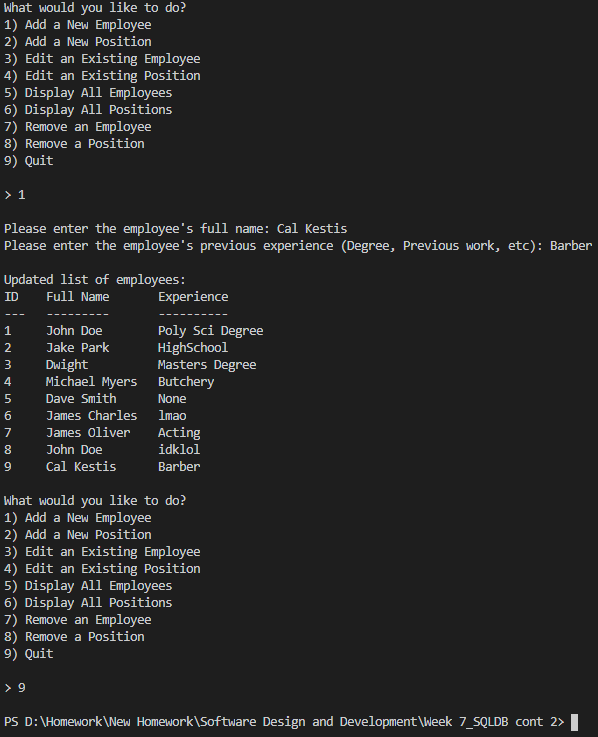
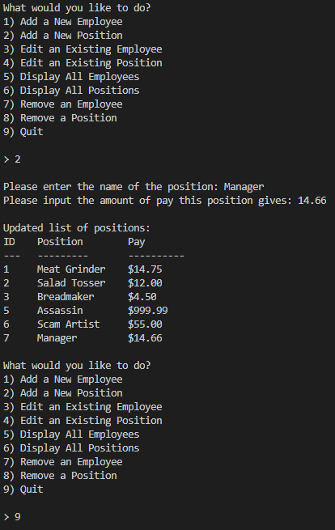
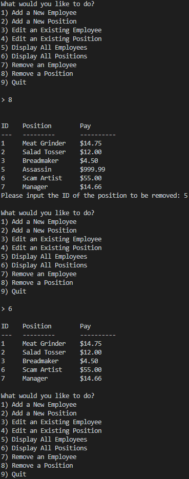
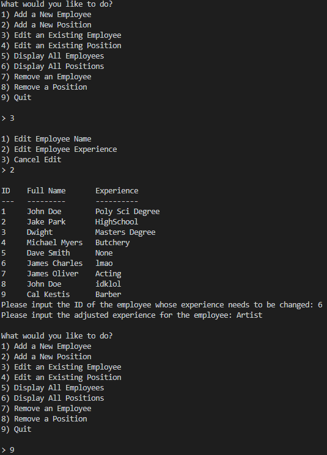

# Overview

This is a simple database program. It allows the user to store/manipulate employee data, including a name and experience, as well as position data, which includes a work position title and an amount of pay for the position.

# Development Environment

* Python 3.8.5
* Visual Studio Code
* SQLite 3

# Execution

To run: `python main.py`   
<b>Adding an Employee:</b> 

 <b>Adding a Position:</b> 

 <b>Deleting/Displaying a Position:</b> 

 <b>Editing an Employee:</b> 

# Useful Websites

1. [Python Reference](https://docs.python.org/3/genindex-I.html)
2. [Stack Overflow Python Questions](https://stackoverflow.com/questions/tagged/python)
3. [W3Schools Python Tutorial](https://www.w3schools.com/python/)
4. [W3Schools SQL Tutorial](https://www.w3schools.com/sql/)